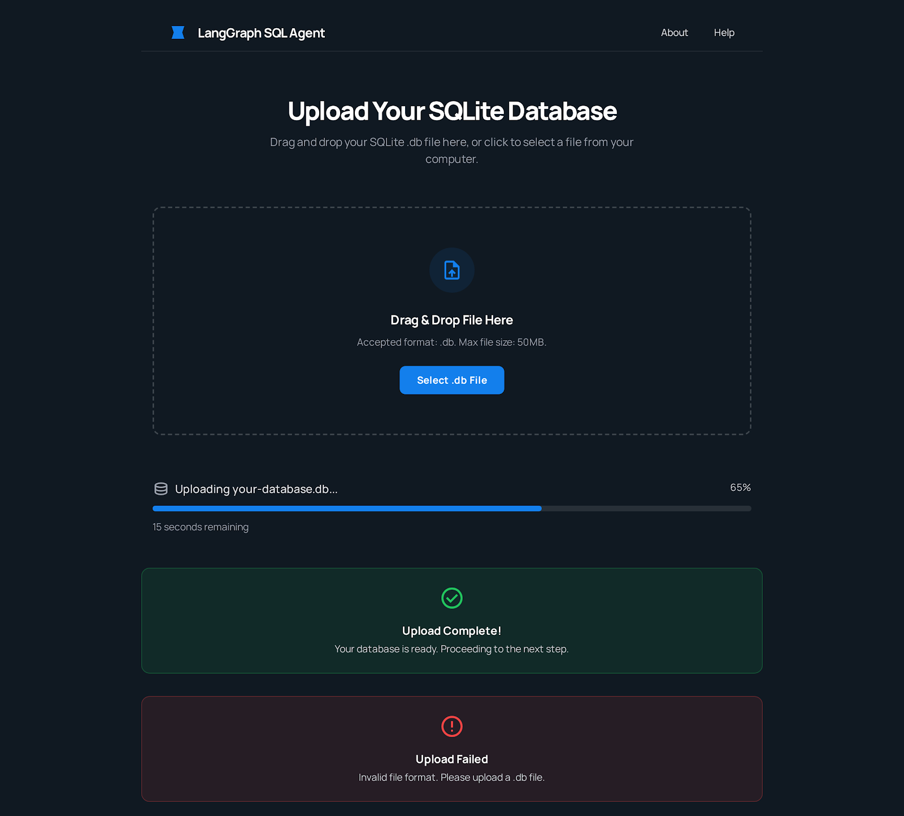
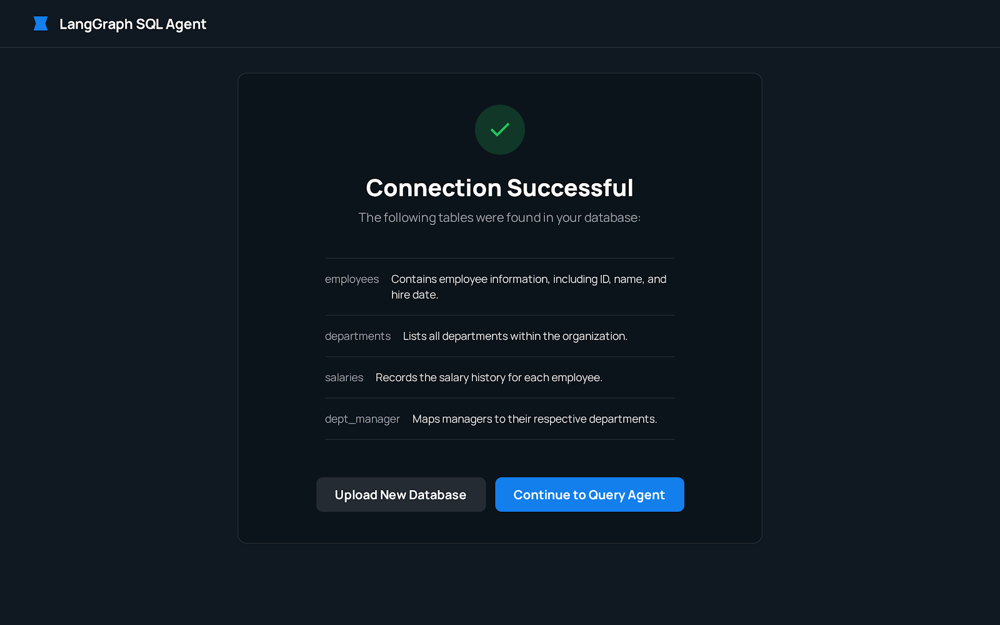

# Database-Agents

A powerful and modular system for building SQL-aware AI Agents using LangGraph, LangChain, and a clean Streamlit frontend. This project demonstrates how LLM-powered agents can interact with databases, run queries, visualize results, and provide natural-language database assistance.

---

## Features

* SQL Agent built on LangGraph
* Natural language to SQL translation
* Table listing, schema analysis, and sample queries
* Optional voice input module
* Clean and easy-to-use Streamlit UI
* Modular API and frontend architecture

---

## Project Structure

```
Database-Agents/
│
├── api/                  # FASTAPI backend used by the Next.js frontend
├── databases/            # SQLite DB files
├── frontend/             # Streamlit UI
├── images/               # Screenshots for repo showcase
├── SQL-Agent/            # SQL agent graphs and logic
├── Voice_Recording.py    # Optional voice input module
├── .env                  # Environment variables
└── .gitignore
```

---

## UI Preview

Below are some visuals from the application:

### Database Upload Screen



### Table List Screen



### Chat Interface


---

## Tech Stack

* Python 3.10+
* LangGraph for graph-based agent flow
* LangChain SQL toolkits
* Streamlit for UI
* SQLite for database operations

---

## How to Run

### 1. Clone the repository

```bash
git clone https://github.com/your-username/Database-Agents.git
cd Database-Agents
```

### 2. Install dependencies

```bash
pip install -r requirements.txt
```

### 3. Add environment variables

Create a `.env` file:

```
OPENAI_API_KEY=your_key_here
```

### 4. Run the Streamlit frontend

```bash
streamlit run frontend/app.py
```

---

## Future Improvements

* Support for PostgreSQL and MySQL
* Schema visualizer and diagram tools
* Multi-agent workflows

---

## Contributions

Open issues or submit pull requests to improve the project.

---
